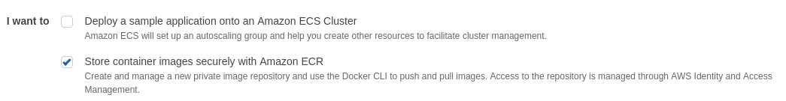

# Übung: Cluster Scheduling mit Amazon ECS

## Vorbereitung

* Legen Sie sich auf Docker Hub einen privaten Account an.
* Installieren Sie die AWS CLI auf ihrem System. https://docs.aws.amazon.com/cli/latest/userguide/installing.html
* Sie erhalten die AWS Zugriffsdaten beim Übungsbetreuer.
* Konfigurieren Sie die AWS CLI: `aws configure`

// DETAILS

## Ziel

Wir wollen im Rahmen dieser Übung eine Beispiel Anwendung auf Amazon EC2 Container Service (ECS) bereitstellen.
Wir verwenden dafür die Anwendung aus der Vorlesung und Übung __"Kommunikation"__.


## Aufgaben

### Vorbereitung

#### Dockerfile erzeugen

Schreiben Sie für den Microservice aus der Übung __"Kommunikation"__ ein `Dockerfile`.
Verwenden Sie das bereitgestellte Dockerfile als Ausgangspunkt.

#### Docker Image lokal bauen

Bauen und testen Sie das Image lokal. Verwenden Sie hierfür die Kommandos aus der Übung __"Virtualisierung"__.

```bash
$ docker build -t book-service:1.0.1 .
$ docker run -it -p 8080:8080 book-service:1.0.1
```

### Getting Started with Amazon EC2 Container Service (ECS)

1. Melden Sie sich mit den AWS Zugriffsdaten über den Browser an der AWS Web Console an.
2. Erstellen Sie einen Amazon EC2 Container Service (ECS) und folgen den Anweisungen.



#### Step 1: Configure repository

Erstellen Sie ein Repository für ihren Service. Am besten bauen Sie den AWS Account-Namen ein, z.B: `cc2017/cc2017-00`.
* Repository Name: `cc2017/cc2017-00`
* Repository URI: 450802564356.dkr.ecr.eu-central-1.amazonaws.com/cc2017/cc2017-00

#### Build, tag, and push Docker image

```bash
aws ecr get-login --no-include-email --region eu-central-1

# kopieren Sie den Output und führen diesen in der Shell aus

docker build -t cc2017/cc2017-00 .
docker tag cc2017/cc2017-00:latest 450802564356.dkr.ecr.eu-central-1.amazonaws.com/cc2017/cc2017-00:latest

# oder

docker tag book-service:1.0.1 450802564356.dkr.ecr.eu-central-1.amazonaws.com/cc2017/cc2017-00:latest

docker push 450802564356.dkr.ecr.eu-central-1.amazonaws.com/cc2017/cc2017-00:latest
```

#### Create a task definition

Nachdem das Image hochgeladen wurde, gehen Sie nun zum nächsten Schritt und erzeugen die Task-Definition.
Vergeben Sie sprechende Namen für `Task definition name` und `Container name`. Als `Memory Limits (MiB)*` setzen Sie `500`.
Bei den Port `Port mappings` setzen Sie den Container-Port `8080`.

#### Configure service

Konfigurieren Sie einen Service für die Task Definition. Setzen Sie einen `Service name` und starten Sie `2` Tasks.
Konfigurieren Sie ebenfalls einen Load-Balancer für den Service.

#### Configure cluster

Konfigurieren Sie den EC2 Cluster. Vergeben Sie einen eindeutigen `Cluster name*`. Verwenden Sie `t2.micro` als `EC2 instance type*` und `2` `Number of instances*`.

#### Review

Prüfen Sie alle Angaben und starten Sie den Cluster.
